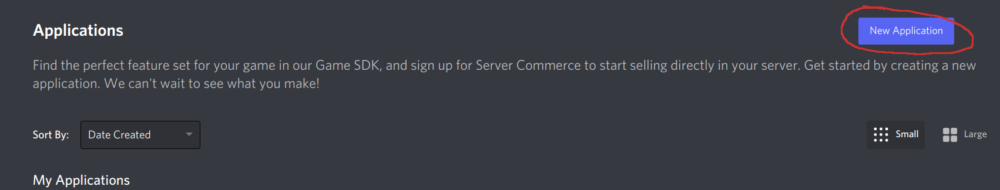

# Joovy

A simple discord music bot.

## Setup dev environment

Pre-requisite:
  - [VSCode](https://code.visualstudio.com/)
  - [Docker](https://www.docker.com/)

In order to get a dev-environment you have open the project using VSCode. You should get a pop-up in the lower right corner prompting you to open the project in a dev-container - press yes. After a while your environment should be ready to go!

## Start a local instance

Follow these steps in order to start a local joovy-instance.

### Create application
To start the application from a dev-environment you must first create an application by navigating to this page - https://discord.com/developers/applications, and then click "New Applicaton".

Copy the application id.

Next, go to the "Bot" section and then click "Add Bot"

And then copy your token

### Invite bot to channel
To invite the bot to your channel press the "OAuth2" button and then press "URL Generator". You should now be presented with a permissions screen. In order for joovy to work you need the following permissions.

And the last step is to copy the generated url at the bottom of the page, go to it, and invite the bot to a channel where you have permissions to do so.

### Create environment file
Create a file called `.env` in the root directory of the project. Copy the application token and application id from the create application step. An example of how you should format this file can be found in `.env.example`.

### Start application

After you've completed all steps above all that's left to do is to start the application, and you can do so by either issuing `yarn start` or pressing `F5` if you're using visual studio code.
